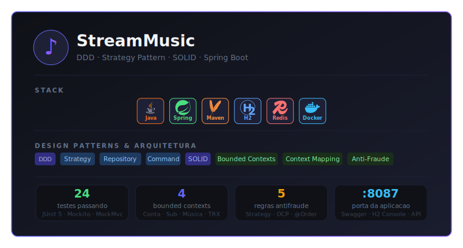
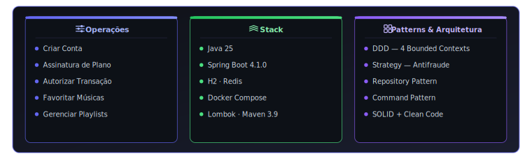
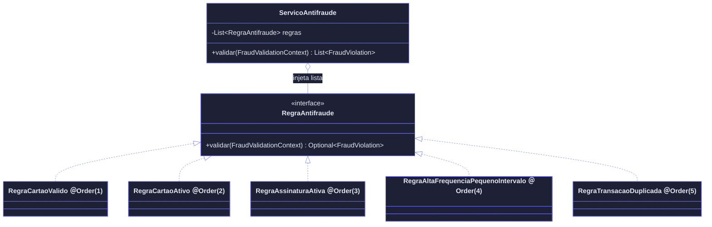
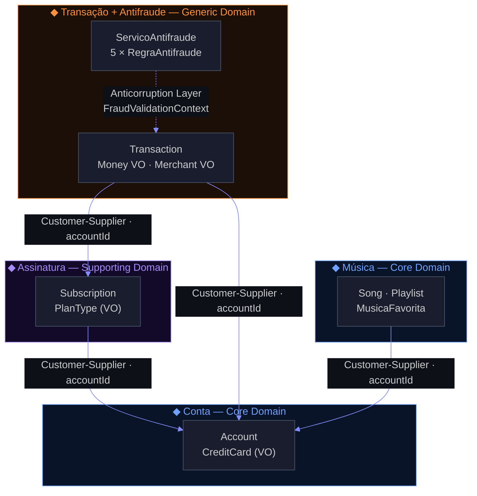
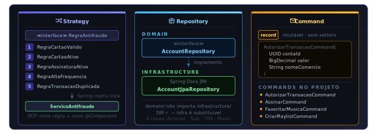
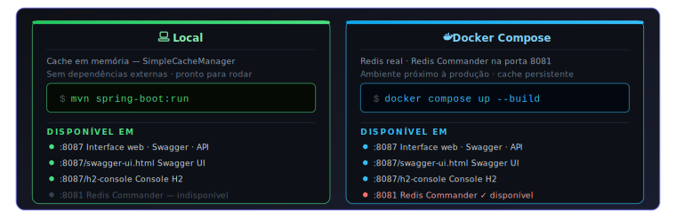

<div align="center">


[](https://git.io/typing-svg)

<a href="https://github.com/andrebecker84"></a>&nbsp;&nbsp;<a href="https://linkedin.com/in/becker84"></a>



</div>

---

##  Índice

<a href="#-visão-geral"><kbd>&nbsp;01&nbsp;</kbd></a> &nbsp; &nbsp;<a href="#-visão-geral"><b>Visão Geral</b></a><br>
<a href="#-regras-de-antifraude--strategy-pattern"><kbd>&nbsp;02&nbsp;</kbd></a> &nbsp; &nbsp;<a href="#-regras-de-antifraude--strategy-pattern"><b>Regras de Antifraude · Strategy Pattern</b></a><br>
<a href="#-arquitetura-ddd"><kbd>&nbsp;03&nbsp;</kbd></a> &nbsp; &nbsp;<a href="#-arquitetura-ddd"><b>Arquitetura DDD</b></a><br>
<a href="#-design-patterns"><kbd>&nbsp;04&nbsp;</kbd></a> &nbsp; &nbsp;<a href="#-design-patterns"><b>Design Patterns</b></a><br>
<a href="#-camadas"><kbd>&nbsp;05&nbsp;</kbd></a> &nbsp; &nbsp;<a href="#-camadas"><b>Camadas</b></a><br>
<a href="#-como-executar"><kbd>&nbsp;06&nbsp;</kbd></a> &nbsp; &nbsp;<a href="#-como-executar"><b>Como Executar</b></a><br>
<a href="#-frontend"><kbd>&nbsp;07&nbsp;</kbd></a> &nbsp; &nbsp;<a href="#-frontend"><b>Frontend</b></a><br>
<a href="#-api-rest"><kbd>&nbsp;08&nbsp;</kbd></a> &nbsp; &nbsp;<a href="#-api-rest"><b>API REST</b></a><br>
<a href="#-testes"><kbd>&nbsp;09&nbsp;</kbd></a> &nbsp; &nbsp;<a href="#-testes"><b>Testes</b></a><br>
<a href="#-clientes-http"><kbd>&nbsp;10&nbsp;</kbd></a> &nbsp; &nbsp;<a href="#-clientes-http"><b>Clientes HTTP</b></a><br>
<a href="#-estrutura"><kbd>&nbsp;11&nbsp;</kbd></a> &nbsp; &nbsp;<a href="#-estrutura"><b>Estrutura de Pastas</b></a><br>
<a href="#-relatório-técnico"><kbd>&nbsp;12&nbsp;</kbd></a> &nbsp; &nbsp;<a href="#-relatório-técnico"><b>Relatório Técnico</b></a>

---

##  Visão Geral

<div align="center">

[](https://openjdk.org)
[](https://spring.io/projects/spring-boot)
[](https://maven.apache.org)
[](https://h2database.com)
[](https://redis.io)
[](https://docker.com)
[](https://projectlombok.org)

</div>

<p align="center">
  
</p>

---

##  Regras de Antifraude — Strategy Pattern

<table width="760" style="border-radius: 10px;">
<thead style="background-color: #0d1117;">
<tr>
  <th align="center" width="36%">Código de Violação</th>
  <th align="center" width="44%">Condição de Rejeição</th>
  <th align="center" width="24%">Classe Strategy</th>
</tr>
</thead>
<tbody style="background-color: #1a1d2e;">
<tr>
  <td><code>cartão-de-crédito-inválido</code></td>
  <td>Conta sem cartão cadastrado</td>
  <td></td>
</tr>
<tr>
  <td><code>cartão-não-ativo</code></td>
  <td>Cartão existe mas está inativo</td>
  <td></td>
</tr>
<tr>
  <td><code>plano-ativo-inválido</code></td>
  <td>Sem assinatura ativa</td>
  <td></td>
</tr>
<tr>
  <td><code>alta-frequência-pequeno-intervalo</code></td>
  <td>Mais de <b>3</b> transações em <b>2 min</b></td>
  <td></td>
</tr>
<tr>
  <td><code>transação-duplicada</code></td>
  <td>Mesmo valor + comércio, <b>2×+</b> em <b>2 min</b></td>
  <td></td>
</tr>
</tbody>
</table>

>  **OCP em ação:** adicionar nova regra = criar `@Component implements RegraAntifraude`. O `ServicoAntifraude` nunca é modificado.

<div style="background:#0d1117;border:1px solid #30363d;border-radius:8px;padding:4px 0;margin:8px 0;">



</div>

**Exemplo de resposta rejeitada:**
```json
{ "aprovada": false, "violacoes": ["cartão-não-ativo", "plano-ativo-inválido"] }
```

---

##  Arquitetura DDD

### Mapa de Contextos

<div style="background:#0d1117;border:1px solid #30363d;border-radius:8px;padding:4px 0;margin:8px 0;">



</div>

> Integração **por referência de UUID** — contextos desacoplados, sem dependência direta entre entidades.


### Aggregates & Value Objects

<table width="760" style="border-radius: 10px;">
<thead style="background-color: #0d1117;">
<tr><th>Aggregate Root</th><th>Value Objects / Filhos</th></tr>
</thead>
<tbody style="background-color: #1a1d2e;">
<tr><td><code>Account</code></td><td><code>CreditCard</code> (VO — @Embeddable): number · active · limit</td></tr>
<tr><td><code>Subscription</code></td><td><code>PlanType</code> (Enum VO): BASICO · PREMIUM · FAMILIA</td></tr>
<tr><td><code>Transaction</code></td><td><code>Money</code> (VO) · <code>Merchant</code> (VO)</td></tr>
<tr><td><code>Playlist</code></td><td><code>List&lt;Song&gt;</code> (ManyToMany)</td></tr>
<tr><td><code>MusicaFavorita</code></td><td><code>Song</code> (Entity — catálogo compartilhado)</td></tr>
</tbody>
</table>

---

##  Design Patterns

<p align="center">
  
</p>

---

##  Camadas

<table width="760" style="border-radius: 10px;">
<thead style="background-color: #0d1117;">
<tr><th width="22%">Camada</th><th width="30%">Pacote</th><th width="48%">Responsabilidade</th></tr>
</thead>
<tbody style="background-color: #1a1d2e;">
<tr><td> Controller</td><td><code>interfaces/rest/</code></td><td>Recebe HTTP · delega ao Application Service</td></tr>
<tr><td> DTO</td><td><code>interfaces/dto/</code></td><td>Contratos de entrada/saída — nunca expõe entidades de domínio</td></tr>
<tr><td> Application Service</td><td><code>application/*/</code></td><td>Orquestra domínio · sem lógica de negócio</td></tr>
<tr><td> Aggregate / Entity</td><td><code>domain/*/</code></td><td>Lógica de negócio · invariantes · estado</td></tr>
<tr><td> Value Object</td><td><code>domain/*/</code></td><td>Imutável · sem identidade própria · igualdade por valor</td></tr>
<tr><td> Repository (interface)</td><td><code>domain/*/</code></td><td>Contrato definido pelo domínio</td></tr>
<tr><td> Repository (JPA)</td><td><code>infrastructure/persistence/</code></td><td>Implementação Spring Data JPA</td></tr>
<tr><td> Strategy</td><td><code>domain/transaction/fraud/</code></td><td>Interface + 5 regras <code>@Component @Order</code></td></tr>
</tbody>
</table>

>  `domain/` nunca importa de `infrastructure/` ou `interfaces/`. Dependências apontam sempre para dentro.

---

##  Como Executar

<p align="center">
  
</p>

###  URLs

<table width="760" style="border-radius: 10px;">
<thead style="background-color: #0d1117;">
<tr><th width="38%">URL</th><th width="62%">Descrição</th></tr>
</thead>
<tbody style="background-color: #1a1d2e;">
<tr><td><a href="http://localhost:8087"><kbd>http://localhost:8087</kbd></a></td><td> Interface web dark-theme</td></tr>
<tr><td><a href="http://localhost:8087/swagger-ui.html"><kbd>http://localhost:8087/swagger-ui.html</kbd></a></td><td> Swagger UI — explorar e testar a API</td></tr>
<tr><td><a href="http://localhost:8087/h2-console"><kbd>http://localhost:8087/h2-console</kbd></a></td><td> Console H2 — JDBC: <code>jdbc:h2:mem:streaming</code> · user: <code>sa</code> · sem senha</td></tr>
<tr><td><a href="http://localhost:8087/api-docs"><kbd>http://localhost:8087/api-docs</kbd></a></td><td> OpenAPI JSON</td></tr>
<tr><td><a href="http://localhost:8081"><kbd>http://localhost:8081</kbd></a></td><td> Redis Commander <em>(somente Docker)</em></td></tr>
</tbody>
</table>

###  Contas Demo

Criadas automaticamente ao iniciar — prontas para testar os cenários de antifraude:

<table width="760" style="border-radius: 10px;">
<thead style="background-color: #0d1117;">
<tr><th width="15%">Conta</th><th width="22%">Número do Cartão</th><th width="10%" align="center">Cartão</th><th width="10%">Plano</th><th width="43%">Cenário de Teste</th></tr>
</thead>
<tbody style="background-color: #1a1d2e;">
<tr><td> João Silva</td><td><code>4111-1111-1111-1111</code></td><td align="center"></td><td align="center" style="white-space:nowrap"><kbd> PREMIUM</kbd></td><td>Transações aprovadas · 4 favoritos · playlist <em>Lo-Fi Essentials</em></td></tr>
<tr><td> Maria Oliveira</td><td><code>5500-0000-0000-0004</code></td><td align="center"></td><td align="center" style="white-space:nowrap"><kbd> BÁSICO</kbd></td><td>Testar limite de frequência</td></tr>
<tr><td> Pedro Santos</td><td><code>3714-496353-98431</code></td><td align="center"></td><td align="center" style="white-space:nowrap"><kbd> sem plano</kbd></td><td><code>cartão-não-ativo</code> + <code>plano-ativo-inválido</code></td></tr>
</tbody>
</table>

---

##  Frontend

<kbd>http://localhost:8087</kbd> — SPA dark-theme embutida no artefato Spring Boot (sem frameworks JS separados)

<table width="760" style="border-radius: 10px;">
<thead style="background-color: #0d1117;">
<tr><th>Aba</th><th>Funcionalidades</th></tr>
</thead>
<tbody style="background-color: #1a1d2e;">
<tr><td> Músicas</td><td>Catálogo completo · copiar ID para clipboard</td></tr>
<tr><td> Conta</td><td>Criar · buscar por ID</td></tr>
<tr><td> Assinatura</td><td>Assinar · consultar · cancelar plano</td></tr>
<tr><td> Transação</td><td>Autorizar · feedback visual de violações antifraude</td></tr>
<tr><td> Favoritos</td><td>Favoritar · listar músicas preferidas</td></tr>
<tr><td> Playlists</td><td>Criar playlist · adicionar músicas</td></tr>
</tbody>
</table>

---

##  API REST

###  Contas

<table width="760" style="border-radius: 10px;">
<thead style="background-color: #0d1117;">
<tr><th>Método</th><th>Endpoint</th><th>Ação</th></tr>
</thead>
<tbody style="background-color: #1a1d2e;">
<tr><td></td><td><code>/api/contas</code></td><td>Criar conta</td></tr>
<tr><td></td><td><code>/api/contas</code></td><td>Listar todas as contas</td></tr>
<tr><td></td><td><code>/api/contas/{id}</code></td><td>Buscar conta por ID</td></tr>
</tbody>
</table>

###  Assinaturas

<table width="760" style="border-radius: 10px;">
<thead style="background-color: #0d1117;">
<tr><th>Método</th><th>Endpoint</th><th>Ação</th></tr>
</thead>
<tbody style="background-color: #1a1d2e;">
<tr><td></td><td><code>/api/assinaturas</code></td><td>Assinar plano</td></tr>
<tr><td></td><td><code>/api/assinaturas/contas/{id}/ativa</code></td><td>Buscar assinatura ativa</td></tr>
<tr><td></td><td><code>/api/assinaturas/contas/{id}</code></td><td>Cancelar assinatura</td></tr>
</tbody>
</table>

###  Transações

<table width="760" style="border-radius: 10px;">
<thead style="background-color: #0d1117;">
<tr><th>Método</th><th>Endpoint</th><th>Ação</th></tr>
</thead>
<tbody style="background-color: #1a1d2e;">
<tr><td></td><td><code>/api/transacoes/autorizar</code></td><td>Autorizar com antifraude</td></tr>
</tbody>
</table>

###  Músicas, Favoritos e Playlists

<table width="760" style="border-radius: 10px;">
<thead style="background-color: #0d1117;">
<tr><th>Método</th><th>Endpoint</th><th>Ação</th></tr>
</thead>
<tbody style="background-color: #1a1d2e;">
<tr><td></td><td><code>/api/musicas</code></td><td>Catálogo (cacheado Redis)</td></tr>
<tr><td></td><td><code>/api/contas/{id}/favoritos</code></td><td>Favoritar música</td></tr>
<tr><td></td><td><code>/api/contas/{id}/favoritos</code></td><td>Listar favoritos</td></tr>
<tr><td></td><td><code>/api/contas/{id}/favoritos/{musicaId}</code></td><td>Remover favorito</td></tr>
<tr><td></td><td><code>/api/contas/{id}/playlists</code></td><td>Criar playlist</td></tr>
<tr><td></td><td><code>/api/contas/{id}/playlists</code></td><td>Listar playlists</td></tr>
<tr><td></td><td><code>/api/playlists/{id}/musicas</code></td><td>Adicionar música</td></tr>
<tr><td></td><td><code>/api/contas/{id}/playlists/{pId}/musicas/{mId}</code></td><td>Remover música</td></tr>
</tbody>
</table>

<details>
<summary> Exemplos cURL</summary>

```bash
# Criar conta
curl -X POST http://localhost:8087/api/contas \
  -H "Content-Type: application/json" \
  -d '{"nome":"João","email":"joao@ex.com","numeroCartao":"4111","cartaoAtivo":true,"limiteCartao":5000}'

# Assinar plano
curl -X POST http://localhost:8087/api/assinaturas \
  -H "Content-Type: application/json" \
  -d '{"contaId":"<UUID>","tipoPlano":"PREMIUM"}'

# Autorizar transação
curl -X POST http://localhost:8087/api/transacoes/autorizar \
  -H "Content-Type: application/json" \
  -d '{"contaId":"<UUID>","valor":99.90,"nomeComercio":"StreamStore"}'
```

</details>

---

##  Testes

<div align="center">

[](https://github.com/andrebecker84)
[](https://github.com/andrebecker84)
[](https://junit.org/junit5)
[](https://site.mockito.org)
[](https://github.com/andrebecker84)

</div>

<table style="background:#0d1117;border:1px solid #30363d;border-radius:8px;border-collapse:separate;font-family:monospace;font-size:13px;margin:4px 0;">
<tr><td style="border:0;padding:8px 16px;"><span style="color:#4b5563;">$</span> <span style="color:#c5f989;">mvn test</span></td></tr>
</table>

Metodologia **AAA (Arrange / Act / Assert)** — `// Act & Assert` somente em `assertThatThrownBy`, onde Act e Assert são inseparáveis por natureza.

<table width="760" style="border-radius: 10px;">
<thead style="background-color: #0d1117;">
<tr>
  <th align="center" width="34%">Classe de Teste</th>
  <th align="center" width="22%">Tipo</th>
  <th align="center" width="36%">Cobertura</th>
  <th align="center" width="8%">#</th>
</tr>
</thead>
<tbody style="background-color: #1a1d2e;">
<tr>
  <td><code>RegraCartaoAtivoTest</code></td>
  <td> Unitário · domínio</td>
  <td>Cartão inativo/ausente → violação correta</td>
  <td align="center"><kbd style="color:#c5f989">3</kbd></td>
</tr>
<tr>
  <td><code>RegraCartaoValidoTest</code></td>
  <td> Unitário · domínio</td>
  <td>Conta sem cartão → <code>cartão-de-crédito-inválido</code></td>
  <td align="center"><kbd style="color:#c5f989">2</kbd></td>
</tr>
<tr>
  <td><code>RegraAltaFrequenciaTest</code></td>
  <td> Unitário · domínio</td>
  <td>Janela de 2 min · limite de 3 TRX</td>
  <td align="center"><kbd style="color:#c5f989">2</kbd></td>
</tr>
<tr>
  <td><code>RegraTransacaoDuplicadaTest</code></td>
  <td> Unitário · domínio</td>
  <td>Limite de 2 transações semelhantes</td>
  <td align="center"><kbd style="color:#c5f989">2</kbd></td>
</tr>
<tr>
  <td><code>TransactionTest</code></td>
  <td> Unitário · domínio</td>
  <td><code>isSimilarTo</code> — valor + comerciante</td>
  <td align="center"><kbd style="color:#c5f989">3</kbd></td>
</tr>
<tr>
  <td><code>AssinaturaApplicationServiceTest</code></td>
  <td> Mockito</td>
  <td>Assinar · cancelar · validar plano único</td>
  <td align="center"><kbd style="color:#c5f989">5</kbd></td>
</tr>
<tr>
  <td><code>TransacaoApplicationServiceTest</code></td>
  <td> Mockito</td>
  <td>Fluxo completo de autorização + fraude</td>
  <td align="center"><kbd style="color:#c5f989">5</kbd></td>
</tr>
<tr>
  <td><code>ContaControllerTest</code></td>
  <td> MockMvc</td>
  <td>HTTP · serialização · status codes</td>
  <td align="center"><kbd style="color:#c5f989">5</kbd></td>
</tr>
<tr>
  <td><code>TransacaoControllerTest</code></td>
  <td> MockMvc</td>
  <td>Aprovação · rejeição · violações JSON</td>
  <td align="center"><kbd style="color:#c5f989">4</kbd></td>
</tr>
<tr>
  <td colspan="3" align="right"><b>Total</b></td>
  <td align="center"></td>
</tr>
</tbody>
</table>

---

##  Clientes HTTP

<table width="760" style="border-radius: 10px;">
<thead style="background-color: #0d1117;">
    <tr>
        <th align="center" width="50%"></th>
        <th align="center" width="50%"></th>
    </tr>
</thead>
<tbody style="background-color: #1a1d2e;">
<tr>
<td valign="top">
<kbd> http/</kbd>
<ol>
    <li>Abra qualquer arquivo <code>.http</code> no IntelliJ IDEA</li>
    <li>Selecione o ambiente <b>local</b> no dropdown (↗ canto superior)</li>
    <li>Execute os arquivos <b>em ordem numérica</b></li>
</ol>

>`contaId` propagado automaticamente via variáveis `@no.env`

<b>Sequência recomendada:</b>
<div style="box-sizing:border-box;background:#0d1117;border:1px solid #1e293b;border-radius:6px;padding:10px 14px;margin-top:6px;font-family:monospace;font-size:12px;line-height:1.7;">
<div style="display:flex;gap:8px;"><span style="width:205px;flex-shrink:0;">01_criar-conta.http</span><span>→  salva contaId</span></div>
<div style="display:flex;gap:8px;"><span style="width:205px;flex-shrink:0;">02_assinatura.http</span><span>→  assina plano PREMIUM</span></div>
<div style="display:flex;gap:8px;"><span style="width:205px;flex-shrink:0;">03_listar-musicas.http</span><span>→  exibe catálogo</span></div>
<div style="display:flex;gap:8px;"><span style="width:205px;flex-shrink:0;">04_favoritar.http</span><span>→  favorita música</span></div>
<div style="display:flex;gap:8px;"><span style="width:205px;flex-shrink:0;">05_playlist.http</span><span>→  cria playlist</span></div>
<div style="display:flex;gap:8px;"><span style="width:205px;flex-shrink:0;">06_transacao.http</span><span>→  análise antifraude</span></div>
</div>
</td>
<td valign="top">
<kbd> bruno/</kbd>
<ol>
<li>No Bruno: <b>Open Collection</b> → selecione a pasta <code>bruno/</code></li>
<li>Selecione o ambiente <b>local</b> em <code>environments/local.bru</code></li>
<li>Execute as requests <b>na ordem das pastas</b></li>
</ol>

>`contaId` e `musicaId` salvos automaticamente via `script:post-response`

<b>Sequência recomendada:</b>
<div style="box-sizing:border-box;background:#0d1117;border:1px solid #1e293b;border-radius:6px;padding:10px 14px;margin-top:6px;font-family:monospace;font-size:12px;line-height:1.7;">
<div style="display:flex;gap:8px;"><span style="width:230px;flex-shrink:0;">1. Conta / Criar Conta</span><span>→  salva contaId</span></div>
<div style="display:flex;gap:8px;"><span style="width:230px;flex-shrink:0;">2. Assinatura / Assinar Plano</span><span>→  assina plano PREMIUM</span></div>
<div style="display:flex;gap:8px;"><span style="width:230px;flex-shrink:0;">3. Musica / Listar Músicas</span><span>→  exibe catálogo</span></div>
<div style="display:flex;gap:8px;"><span style="width:230px;flex-shrink:0;">4. Musica / Favoritar</span><span>→  favorita música</span></div>
<div style="display:flex;gap:8px;"><span style="width:230px;flex-shrink:0;">5. Playlist / Criar Playlist</span><span>→  cria playlist</span></div>
<div style="display:flex;gap:8px;"><span style="width:230px;flex-shrink:0;">6. Transacao / Autorizar</span><span>→  análise antifraude</span></div>
</div>
</td>
</tr>
</tbody>
</table>

---

##  Estrutura

<details>
<summary> Ver árvore completa de pacotes</summary>

<table style="background:#0d1117;border:1px solid #30363d;border-radius:8px;border-collapse:collapse;width:100%;font-family:monospace;font-size:12px;line-height:1.3;margin-top:8px;">
<tbody style="border:0;">
<tr style="border:0;"><td style="border:0;padding:5px 8px 2px 8px;white-space:nowrap;color:#c9d1d9;"> <b>StreamMusic</b></td><td style="border:0;padding:1px 8px;color:#4a5568;font-size:11px;"></td></tr>
<tr style="border:0;"><td style="border:0;padding:1px 8px;white-space:nowrap;color:#c9d1d9;"><span style="color:#3d4451">├─&nbsp;</span> src/main/java/…/musica</td><td style="border:0;"></td></tr>
<tr style="border:0;"><td style="border:0;padding:1px 8px;white-space:nowrap;color:#c9d1d9;"><span style="color:#3d4451">│&nbsp;&nbsp;├─&nbsp;</span> <b>domain</b></td><td style="border:0;padding:1px 8px;color:#4a5568;font-size:11px;">Núcleo puro — zero dependências externas</td></tr>
<tr style="border:0;"><td style="border:0;padding:1px 8px;white-space:nowrap;color:#c9d1d9;"><span style="color:#3d4451">│&nbsp;&nbsp;│&nbsp;&nbsp;├─&nbsp;</span> account</td><td style="border:0;padding:1px 8px;color:#71a1fe;font-size:11px;"> Conta (Core Domain)</td></tr>
<tr style="border:0;"><td style="border:0;padding:1px 8px;white-space:nowrap;color:#c9d1d9;"><span style="color:#3d4451">│&nbsp;&nbsp;│&nbsp;&nbsp;│&nbsp;&nbsp;├─&nbsp;</span> Account.java</td><td style="border:0;padding:1px 8px;color:#4a5568;font-size:11px;">Aggregate Root</td></tr>
<tr style="border:0;"><td style="border:0;padding:1px 8px;white-space:nowrap;color:#c9d1d9;"><span style="color:#3d4451">│&nbsp;&nbsp;│&nbsp;&nbsp;│&nbsp;&nbsp;├─&nbsp;</span> CreditCard.java</td><td style="border:0;padding:1px 8px;color:#4a5568;font-size:11px;">Value Object (@Embeddable)</td></tr>
<tr style="border:0;"><td style="border:0;padding:1px 8px;white-space:nowrap;color:#c9d1d9;"><span style="color:#3d4451">│&nbsp;&nbsp;│&nbsp;&nbsp;│&nbsp;&nbsp;└─&nbsp;</span> AccountRepository.java</td><td style="border:0;padding:1px 8px;color:#4a5568;font-size:11px;">Interface de repositório</td></tr>
<tr style="border:0;"><td style="border:0;padding:1px 8px;white-space:nowrap;color:#c9d1d9;"><span style="color:#3d4451">│&nbsp;&nbsp;│&nbsp;&nbsp;├─&nbsp;</span> subscription</td><td style="border:0;padding:1px 8px;color:#a78bfa;font-size:11px;"> Assinatura (Supporting Domain)</td></tr>
<tr style="border:0;"><td style="border:0;padding:1px 8px;white-space:nowrap;color:#c9d1d9;"><span style="color:#3d4451">│&nbsp;&nbsp;│&nbsp;&nbsp;├─&nbsp;</span> transaction</td><td style="border:0;padding:1px 8px;color:#a78bfa;font-size:11px;"> Transação (Generic Domain)</td></tr>
<tr style="border:0;"><td style="border:0;padding:1px 8px;white-space:nowrap;color:#c9d1d9;"><span style="color:#3d4451">│&nbsp;&nbsp;│&nbsp;&nbsp;│&nbsp;&nbsp;└─&nbsp;</span> fraud</td><td style="border:0;padding:1px 8px;color:#71a1fe;font-size:11px;"> Antifraude — Strategy Pattern</td></tr>
<tr style="border:0;"><td style="border:0;padding:1px 8px;white-space:nowrap;color:#c9d1d9;"><span style="color:#3d4451">│&nbsp;&nbsp;│&nbsp;&nbsp;│&nbsp;&nbsp;&nbsp;&nbsp;&nbsp;├─&nbsp;</span> RegraAntifraude.java</td><td style="border:0;padding:1px 8px;color:#4a5568;font-size:11px;">Interface Strategy</td></tr>
<tr style="border:0;"><td style="border:0;padding:1px 8px;white-space:nowrap;color:#c9d1d9;"><span style="color:#3d4451">│&nbsp;&nbsp;│&nbsp;&nbsp;│&nbsp;&nbsp;&nbsp;&nbsp;&nbsp;├─&nbsp;</span> ServicoAntifraude.java</td><td style="border:0;padding:1px 8px;color:#4a5568;font-size:11px;">Domain Service</td></tr>
<tr style="border:0;"><td style="border:0;padding:1px 8px;white-space:nowrap;color:#c9d1d9;"><span style="color:#3d4451">│&nbsp;&nbsp;│&nbsp;&nbsp;│&nbsp;&nbsp;&nbsp;&nbsp;&nbsp;└─&nbsp;</span> Regra*.java × 5</td><td style="border:0;padding:1px 8px;color:#4a5568;font-size:11px;">Implementações @Component @Order</td></tr>
<tr style="border:0;"><td style="border:0;padding:1px 8px;white-space:nowrap;color:#c9d1d9;"><span style="color:#3d4451">│&nbsp;&nbsp;│&nbsp;&nbsp;└─&nbsp;</span> music</td><td style="border:0;padding:1px 8px;color:#a78bfa;font-size:11px;"> Música (Core Domain)</td></tr>
<tr style="border:0;"><td style="border:0;padding:1px 8px;white-space:nowrap;color:#c9d1d9;"><span style="color:#3d4451">│&nbsp;&nbsp;├─&nbsp;</span> <b>application</b></td><td style="border:0;padding:1px 8px;color:#4a5568;font-size:11px;">Casos de uso — Commands + Services</td></tr>
<tr style="border:0;"><td style="border:0;padding:1px 8px;white-space:nowrap;color:#c9d1d9;"><span style="color:#3d4451">│&nbsp;&nbsp;├─&nbsp;</span> <b>infrastructure</b></td><td style="border:0;padding:1px 8px;color:#4a5568;font-size:11px;">JPA · Redis · Config · DataInitializer</td></tr>
<tr style="border:0;"><td style="border:0;padding:1px 8px;white-space:nowrap;color:#c9d1d9;"><span style="color:#3d4451">│&nbsp;&nbsp;└─&nbsp;</span> <b>interfaces/rest</b></td><td style="border:0;padding:1px 8px;color:#4a5568;font-size:11px;">Controllers REST · DTOs</td></tr>
<tr style="border:0;"><td style="border:0;padding:1px 8px;white-space:nowrap;color:#c9d1d9;"><span style="color:#3d4451">├─&nbsp;</span> src/main/resources</td><td style="border:0;"></td></tr>
<tr style="border:0;"><td style="border:0;padding:1px 8px;white-space:nowrap;color:#c9d1d9;"><span style="color:#3d4451">│&nbsp;&nbsp;├─&nbsp;</span> application.properties</td><td style="border:0;padding:1px 8px;color:#4a5568;font-size:11px;">Porta 8087 · cache simple/redis</td></tr>
<tr style="border:0;"><td style="border:0;padding:1px 8px;white-space:nowrap;color:#c9d1d9;"><span style="color:#3d4451">│&nbsp;&nbsp;├─&nbsp;</span> data.sql</td><td style="border:0;padding:1px 8px;color:#4a5568;font-size:11px;">12 músicas seed (catálogo lo-fi CC)</td></tr>
<tr style="border:0;"><td style="border:0;padding:1px 8px;white-space:nowrap;color:#c9d1d9;"><span style="color:#3d4451">│&nbsp;&nbsp;└─&nbsp;</span> static/index.html</td><td style="border:0;padding:1px 8px;color:#4a5568;font-size:11px;">SPA dark-theme</td></tr>
<tr style="border:0;"><td style="border:0;padding:1px 8px;white-space:nowrap;color:#c9d1d9;"><span style="color:#3d4451">├─&nbsp;</span> <b>src/test</b></td><td style="border:0;padding:1px 8px;color:#c5f989;font-size:11px;"> 31 testes — JUnit 5 · Mockito · MockMvc</td></tr>
<tr style="border:0;"><td style="border:0;padding:1px 8px;white-space:nowrap;color:#c9d1d9;"><span style="color:#3d4451">├─&nbsp;</span> http</td><td style="border:0;padding:1px 8px;color:#4a5568;font-size:11px;">IntelliJ HTTP Client (6 arquivos .http)</td></tr>
<tr style="border:0;"><td style="border:0;padding:1px 8px;white-space:nowrap;color:#c9d1d9;"><span style="color:#3d4451">├─&nbsp;</span> bruno</td><td style="border:0;padding:1px 8px;color:#4a5568;font-size:11px;">Bruno Collection (16 arquivos .bru)</td></tr>
<tr style="border:0;"><td style="border:0;padding:1px 8px;white-space:nowrap;color:#c9d1d9;"><span style="color:#3d4451">├─&nbsp;</span> doc/RELATORIO_AT.md</td><td style="border:0;padding:1px 8px;color:#4a5568;font-size:11px;">Relatório técnico completo</td></tr>
<tr style="border:0;"><td style="border:0;padding:1px 8px;white-space:nowrap;color:#c9d1d9;"><span style="color:#3d4451">├─&nbsp;</span> Dockerfile</td><td style="border:0;padding:1px 8px;color:#4a5568;font-size:11px;">Multi-stage build (Maven → JRE Alpine)</td></tr>
<tr style="border:0;"><td style="border:0;padding:1px 8px 5px 8px;white-space:nowrap;color:#c9d1d9;"><span style="color:#3d4451">└─&nbsp;</span> docker-compose.yml</td><td style="border:0;padding:1px 8px;color:#4a5568;font-size:11px;">Redis · App · Redis Commander</td></tr>
</tbody>
</table>

</details>

---

##  Relatório Técnico

<div align="center">
<a href="doc/RELATORIO_AT.md"></a>&nbsp;&nbsp;
<a href="LICENSE"></a>
</div>

> Justificativas completas sobre Design Patterns, SOLID, DDD estratégico/tático, Aggregates, Context Map e Domínio Rico.
Inclui as **referências bibliográficas** completas (Evans, Martin, Gamma/GoF, Vernon).

---

<div align="center">



[-7c5cbf?style=for-the-badge)](https://www.infnet.edu.br)

</div>
