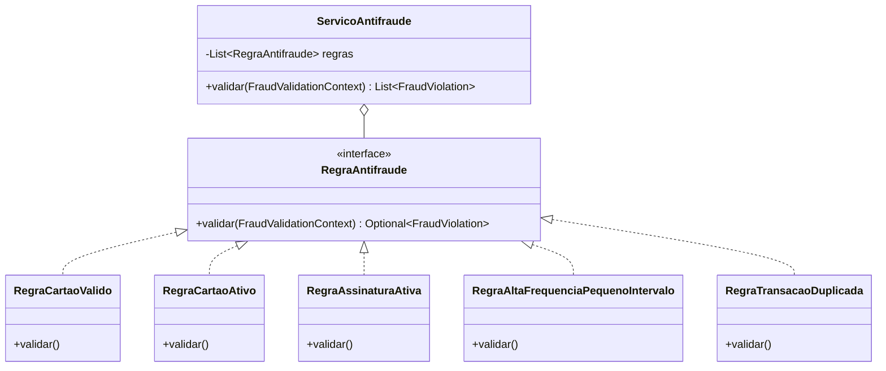
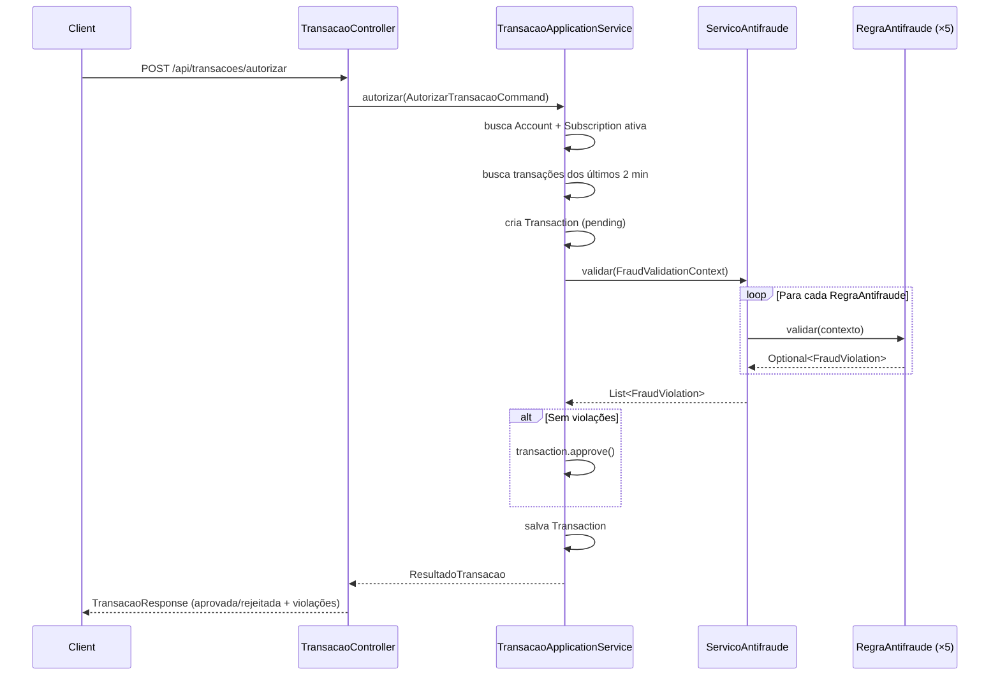
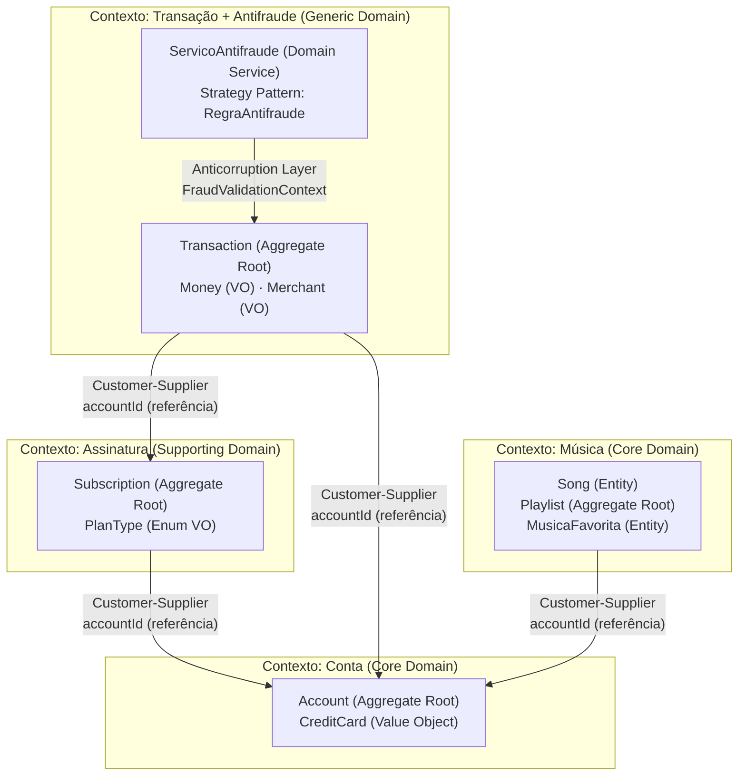
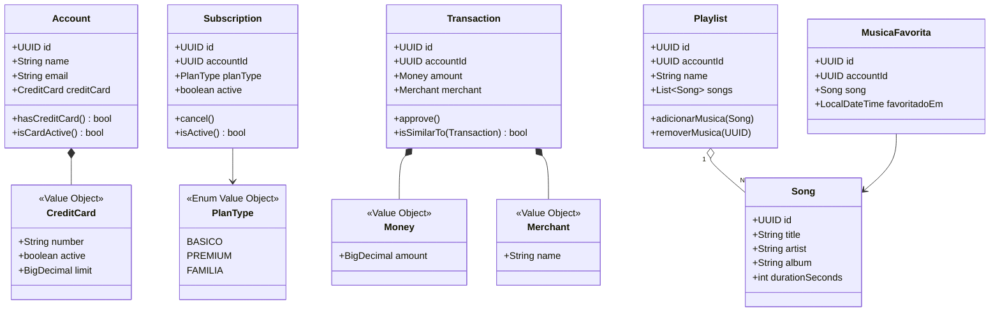

# Relatório Técnico — StreamMusic

>**Disciplina:** DR2 — Design Patterns e Domain-Driven Design (DDD) com Java  
**Instituto:** Infnet  
**Aluno:** André Luis Becker  
**Data:** Junho 2026

---

## 1. Importância dos Padrões de Design

Padrões de design (Design Patterns) são soluções consolidadas para problemas recorrentes no desenvolvimento de software. No contexto desta plataforma de streaming, eles desempenham papel fundamental em três aspectos:

**Organização:** ao invés de soluções ad hoc, os padrões fornecem vocabulário compartilhado entre desenvolvedores. Quando a equipe vê `RegraAntifraude`, imediatamente reconhece a intenção Strategy — uma interface que define uma família de algoritmos intercambiáveis.

**Reutilização:** cada regra de antifraude (`RegraCartaoAtivo`, `RegraAltaFrequenciaPequenoIntervalo`, etc.) é uma classe independente e reutilizável em diferentes contextos de validação sem duplicação de lógica.

**Manutenibilidade:** novos requisitos de negócio (ex.: nova regra de fraude para detecção de localização geográfica) não exigem modificação das classes existentes — apenas a criação de uma nova implementação. Isso é diretamente possibilitado pelo Open-Closed Principle (OCP) habilitado pelo Strategy Pattern.

---

## 2. Princípios SOLID Aplicados

| Princípio                       | Como foi aplicado neste projeto                                                                                                                                                                                                      |
|---------------------------------|--------------------------------------------------------------------------------------------------------------------------------------------------------------------------------------------------------------------------------------|
| **S** — *Single Responsibility* | `ContaApplicationService` gerencia apenas casos de uso de Conta. `ServicoAntifraude` apenas orquestra as regras. Cada `RegraAntifraude` valida apenas uma regra específica.                                                          |
| **O** — *Open/Closed*           | O `ServicoAntifraude` nunca é modificado para adicionar novas regras. Uma nova classe `@Component` implementando `RegraAntifraude` é automaticamente detectada pelo Spring e inserida na lista.                                      |
| **L** — *Liskov Substitution*   | Qualquer implementação de `RegraAntifraude` pode ser substituída por outra sem quebrar o `ServicoAntifraude`. `RegraCartaoAtivo` e `RegraTransacaoDuplicada` são completamente intercambiáveis na perspectiva do serviço consumidor. |
| **I** — *Interface Segregation* | Os repositórios de domínio (`AccountRepository`, `SongRepository`, etc.) são interfaces focadas, com apenas os métodos necessários para aquele contexto. Nenhum serviço é forçado a depender de métodos irrelevantes.                |
| **D** — *Dependency Inversion*  | `TransacaoApplicationService` depende de `AccountRepository` (interface de domínio), não de `AccountJpaRepository` (implementação JPA). A inversão é gerenciada pelo Spring, que injeta a implementação concreta.                    |

---

## 3. Padrões de Projeto Utilizados

### 3.1 Strategy Pattern — Regras de Antifraude

**Problema:** O sistema precisa validar transações contra múltiplas regras de negócio. As regras podem mudar e crescer ao longo do tempo.

**Solução:** A interface `RegraAntifraude` define o contrato de validação. Cada regra é uma implementação independente. O `ServicoAntifraude` (Domain Service) recebe a lista de regras via injeção de dependência e as executa sequencialmente, coletando todas as violações.



**Benefício:** Adicionar uma nova regra (`RegraLocalizacaoGeografica`, por exemplo) requer apenas criar uma nova classe anotada com `@Component` e `@Order`. O `ServicoAntifraude` não é alterado — OCP em ação.

### 3.2 Repository Pattern — Persistência

**Problema:** A lógica de domínio não deve conhecer detalhes de persistência (SQL, JPA, etc.).

**Solução:** Interfaces de repositório vivem no domínio (`AccountRepository`, `SubscriptionRepository`). As implementações JPA vivem na infraestrutura e estendem tanto a interface de domínio quanto `JpaRepository<T, UUID>`, permitindo que o Spring Data gere as implementações automaticamente.

```
domain/account/AccountRepository (interface pura)
    ↑ implementada por
infrastructure/persistence/AccountJpaRepository extends JpaRepository + AccountRepository
```

**Benefício:** O domínio permanece puro (sem imports JPA). A infraestrutura pode ser trocada (ex.: PostgreSQL, MongoDB) sem tocar no domínio.

### 3.3 Command Pattern — Casos de Uso

Cada caso de uso da camada de aplicação recebe um objeto Command imutável (Java record), que encapsula todos os parâmetros necessários:

```java
public record AutorizarTransacaoCommand(UUID contaId, BigDecimal valor, String nomeComercio) {}
```

**Benefício:** Commands são fáceis de testar, logar e versionar. O controller não conhece os detalhes do caso de uso — apenas monta o Command e o entrega ao serviço.

### 3.4 Facade Pattern (implícito nos Application Services)

Os Application Services atuam como fachadas para cada Bounded Context, orquestrando operações complexas que envolvem múltiplos repositórios e serviços de domínio:

```java
// TransacaoApplicationService orquestra:
// - AccountRepository (buscar conta)
// - SubscriptionRepository (verificar assinatura)
// - TransactionRepository (buscar recentes + salvar)
// - ServicoAntifraude (validar)
```

### 3.5 Padrões de Criação (Creational) — Factory implícito no Domínio

**Problema:** Objetos de domínio nunca devem ser criados em estado inválido. Um `Transaction` sem `accountId`, ou um `Money` com valor negativo, corromperia as invariantes do negócio.

**Solução:** Cada Aggregate e Value Object aplica o padrão **Factory Method** via construtor protegido + construtor público com validação:

```java
@NoArgsConstructor(access = AccessLevel.PROTECTED) // bloqueia criação direta pelo JPA/frameworks
public class Account {
    public Account(String name, String email, CreditCard creditCard) {
        Objects.requireNonNull(name, "Nome é obrigatório");   // invariante
        this.id = UUID.randomUUID();                           // identidade gerada aqui
        // ...
    }
}
```

O único ponto de criação válido é o construtor público — garantindo que o objeto nasce sempre em estado consistente. O JPA usa o construtor protegido apenas para reconstruir objetos já persistidos, nunca para criar novos.

Adicionalmente, o contêiner Spring atua como **IoC Container (Registry)** — um padrão criacional que gerencia o ciclo de vida de `@Service`, `@Component` e `@Repository`, injetando dependências automaticamente via construtor (Dependency Injection como Factory).

### 3.6 Fluxo de Autorização de Transação



---

## 4. Domain-Driven Design (DDD) — Design Estratégico

### 4.1 Como o DDD auxilia na gestão da complexidade

O DDD é uma abordagem que alinha o modelo de software com o modelo mental dos especialistas de domínio (domain experts). Em vez de construir um sistema centrado em tabelas de banco de dados, o DDD constrói o sistema centrado no conhecimento do negócio.

No streaming de música, a complexidade vem de múltiplas áreas: gerenciamento de usuários, cobranças com antifraude, e entrega de conteúdo musical. O DDD divide essa complexidade em contextos isolados e coesos.

### 4.2 Subdomínios Identificados

| Tipo           | Subdomínio                              | Justificativa                      |
|----------------|-----------------------------------------|------------------------------------|
| **Core**       | Música (Catálogo, Favoritos, Playlists) | Diferencial competitivo do negócio |
| **Core**       | Conta (Account)                         | Identidade central do usuário      |
| **Supporting** | Assinatura (Subscription)               | Necessário mas não diferenciador   |
| **Generic**    | Transação + Antifraude                  | Poderia ser adquirido de terceiros |

### 4.3 Bounded Contexts e Linguagem Ubíqua

Cada Bounded Context possui sua própria **Linguagem Ubíqua** — termos com significado preciso dentro daquele contexto:

**Contexto: Conta**
- `Account` — entidade que representa um usuário cadastrado
- `CreditCard` — cartão de crédito associado à conta (Value Object)
- `isCardActive()` — método que expressa intenção do negócio em linguagem do domínio

**Contexto: Assinatura**
- `Subscription` — contrato de assinatura de um plano
- `PlanType` — enum que enumera os planos disponíveis (BASICO, PREMIUM, FAMILIA)
- `cancel()` — ação de negócio que cancela a assinatura ativa

**Contexto: Transação & Antifraude**
- `Transaction` — transação financeira pendente de autorização
- `FraudViolation` — violação de uma regra de antifraude identificada
- `isSimilarTo()` — método no Transaction que expressa semântica de negócio

**Contexto: Música**
- `Playlist` — coleção de músicas curada por um usuário
- `MusicaFavorita` — relação entre uma conta e uma música favorita
- `adicionarMusica()` — ação de domínio na Playlist

### 4.4 Mapa de Contextos (Context Map)



**Tipos de Relacionamento:**
- **Customer-Supplier:** O contexto de Transação é consumidor (Customer) dos dados de Conta e Assinatura. A Conta e Assinatura são provedores (Suppliers) que expõem informações via seus repositórios de domínio.
- **Anticorruption Layer:** O `FraudValidationContext` é um record que **traduz** os modelos dos contextos Conta, Assinatura e Transação para a linguagem própria do antifraude — apenas tipos primitivos (`cartaoCadastrado`, `cartaoAtivo`, `assinaturaAtiva`, `quantidadeTransacoesRecentes`, `quantidadeTransacoesSemelhantes`). As regras nunca tocam os agregados crus de outros contextos; o `TransacaoApplicationService` faz a tradução na fronteira. Isso protege o contexto de antifraude de mudanças nos modelos externos.

A integração se dá **por referência de ID** (UUID), não por objeto — os contextos são desacoplados e se comunicam apenas através de identificadores, preservando a autonomia de cada Bounded Context.

**Estratégias de comunicação e tecnologias possíveis:**

| Estratégia | Tecnologia | Quando usar |
|---|---|---|
| **Chamada direta (adotada)** | REST via Spring MVC | Contextos no mesmo processo; consistência imediata |
| **Mensageria assíncrona** | Kafka, RabbitMQ | Desacoplamento temporal; eventual consistency |
| **RPC binário** | gRPC | Alta performance entre microsserviços; contratos fortemente tipados |
| **Eventos de domínio** | Spring Events / Kafka | Notificar outros contextos sem acoplamento direto |

Neste projeto todos os bounded contexts residem no mesmo processo Spring Boot, tornando a chamada direta por repositório a abordagem mais adequada. Em uma arquitetura de microsserviços, cada contexto seria um serviço independente e a comunicação passaria por REST ou mensageria, com o `FraudValidationContext` (Anticorruption Layer) traduzindo as mensagens recebidas para o modelo interno do contexto de antifraude.

---

## 5. Design Tático — Aggregates, Entities e Value Objects

O **design tático** do DDD trata da implementação concreta dentro de cada Bounded Context: como modelar entidades, value objects e aggregates que expressam fielmente as regras do negócio em código. Enquanto o design estratégico define *o quê* e *onde*, o design tático define *como* — as estruturas internas de cada contexto.

Neste projeto, o design tático se manifesta em:
- **Aggregates** com construtores validadores (invariantes protegidas desde a criação)
- **Value Objects** imutáveis com `equals`/`hashCode` baseados em valor, não em referência
- **Domain Services** para lógica que cruza múltiplas entidades (`ServicoAntifraude`)
- **Intention Revealing Interfaces** nos repositórios (`findActiveByAccountId`, `hasActiveSubscription`, `findByAccountIdAndOccurredAtAfter`) — nomes que expressam intenção de negócio, não detalhes técnicos

### 5.1 Modelo de Domínio



### 5.2 Entities (Entidades)

Possuem identidade única e ciclo de vida próprio:

| Entidade         | Identidade                | Ciclo de Vida                          |
|------------------|---------------------------|----------------------------------------|
| `Account`        | UUID gerado no construtor | Criada → Ativa (imutável após criação) |
| `Subscription`   | UUID gerado no construtor | Criada → Ativa → Cancelada             |
| `Transaction`    | UUID gerado no construtor | Pendente → Aprovada / Rejeitada        |
| `Playlist`       | UUID gerado no construtor | Criada → Músicas adicionadas/removidas |
| `Song`           | UUID fixo (seed)          | Catálogo (não muda)                    |
| `MusicaFavorita` | UUID gerado no construtor | Criada → Removida                      |

### 5.3 Value Objects (Objetos de Valor)

Imutáveis, sem identidade própria, definidos pelos seus atributos:

| Value Object | Atributos                | Por que é VO?                                                             |
|--------------|--------------------------|---------------------------------------------------------------------------|
| `CreditCard` | number, active, limit    | Dois cartões com mesmo número são iguais; não têm identidade independente |
| `Money`      | amount (BigDecimal)      | Apenas o valor importa; igualdade por valor, não por referência           |
| `Merchant`   | name (String)            | Representa o comércio apenas pelo nome; imutável                          |
| `PlanType`   | BASICO, PREMIUM, FAMILIA | Enum — valor puro sem identidade                                          |

### 5.4 Aggregate Roots

Pontos de entrada para modificação do estado:

| Aggregate Root | Invariantes Protegidas                                           |
|----------------|------------------------------------------------------------------|
| `Account`      | Nome e e-mail obrigatórios no construtor (`Objects.requireNonNull`); o cartão é opcional na criação e sua ausência é validada como regra de antifraude (`cartão-de-crédito-inválido`) no momento da transação |
| `Subscription` | Só cancela se estiver ativa (`cancel()` valida o estado)         |
| `Transaction`  | Estado pendente → aprovada é unidirecional (`approve()`)         |
| `Playlist`     | Impede músicas duplicadas (`adicionarMusica()` verifica a lista) |

### 5.5 Domain Services

Operações que não pertencem naturalmente a uma única entidade:

- **`ServicoAntifraude`** — Precisa de Account, Subscription e lista de Transactions para validar. Nenhuma dessas entidades individualmente tem conhecimento suficiente para aplicar todas as regras.

---

## 6. Modelo de Domínio Rico vs. Anêmico

Este projeto implementa um **modelo rico**, onde a lógica de negócio vive nas entidades e value objects, não apenas nos services:

```java
// RICO: lógica no domínio
account.isCardActive()           // CreditCard encapsula a verificação
subscription.cancel()            // Valida estado e define cancelledAt
transaction.approve()            // Transição de estado encapsulada
transaction.isSimilarTo(other)   // Semântica de negócio na entidade
playlist.adicionarMusica(song)   // Valida duplicatas no aggregate

// ANÊMICO seria: if (account.getCreditCard().getActive()) {...} no service
```

---

## 7. Arquitetura em Camadas

```
src/main/java/com/streaming/musica/
├── domain/                        # Núcleo do domínio — sem dependências externas
│   ├── account/                   # Bounded Context: Conta
│   ├── subscription/              # Bounded Context: Assinatura
│   ├── transaction/               # Bounded Context: Transação
│   │   └── fraud/                 # Sub-domínio: Antifraude (Strategy Pattern)
│   └── music/                     # Bounded Context: Música
├── application/                   # Casos de uso — orquestra o domínio
│   ├── account/
│   ├── subscription/
│   ├── transaction/
│   └── music/
├── infrastructure/                # Adaptadores de persistência (JPA + H2 + Redis)
│   ├── persistence/
│   └── config/
├── interfaces/                    # Adaptadores de entrada (REST)
│   ├── rest/
│   └── dto/
└── shared/                        # Exceções compartilhadas
```

| Camada tradicional | Pacote DDD | Exemplos |
|-------------------|------------|----------|
| **Controller** | `interfaces/rest/` | `ContaController`, `AssinaturaController`, `TransacaoController`, `MusicaController` |
| **DTO** | `interfaces/dto/` | `CriarContaRequest`, `ContaResponse`, `AutorizarTransacaoRequest`, `TransacaoResponse` |
| **Service** | `application/*/` | `ContaApplicationService`, `AssinaturaApplicationService`, `TransacaoApplicationService` |
| **Model / Entity** | `domain/*/` | `Account`, `Subscription`, `Transaction`, `Song`, `Playlist`, `MusicaFavorita` |
| **Repository (interface)** | `domain/*/` | `AccountRepository`, `SubscriptionRepository`, `TransactionRepository` |
| **Repository (impl)** | `infrastructure/persistence/` | `AccountJpaRepository`, `SubscriptionJpaRepository` |
| **Strategy** | `domain/transaction/fraud/` | `RegraAntifraude` + 5 implementações |

---

## 8. Regras de Negócio — Antifraude

| Código | Regra | Verificado em |
|--------|-------|---------------|
| `cartão-de-crédito-inválido` | Usuário deve ter cartão cadastrado | Autorização de transação |
| `cartão-não-ativo` | Cartão deve estar ativo | Autorização de transação |
| `plano-ativo-inválido` | Usuário deve ter assinatura ativa | Autorização de transação |
| `alta-frequência-pequeno-intervalo` | Máx. 3 transações em 2 minutos | Autorização de transação |
| `transação-duplicada` | Máx. 2 transações com mesmo valor e comércio em 2 min | Autorização de transação |
| `limite-de-plano-ativo` | Apenas 1 plano ativo por conta | Criação de assinatura |

---

## 9. Endpoints REST

### Contas
| Método | URL | Descrição |
|--------|-----|-----------|
| `POST` | `/api/contas` | Criar conta |
| `GET` | `/api/contas` | Listar todas as contas |
| `GET` | `/api/contas/{id}` | Buscar conta por ID |

### Assinaturas
| Método | URL | Descrição |
|--------|-----|-----------|
| `POST` | `/api/assinaturas` | Assinar plano |
| `DELETE` | `/api/assinaturas/contas/{contaId}` | Cancelar assinatura |
| `GET` | `/api/assinaturas/contas/{contaId}/ativa` | Buscar assinatura ativa |

### Transações
| Método | URL | Descrição |
|--------|-----|-----------|
| `POST` | `/api/transacoes/autorizar` | Autorizar transação (com antifraude) |

### Músicas, Favoritos e Playlists
| Método | URL | Descrição |
|--------|-----|-----------|
| `GET` | `/api/musicas` | Listar todas as músicas (cacheado) |
| `POST` | `/api/contas/{contaId}/favoritos` | Favoritar música |
| `GET` | `/api/contas/{contaId}/favoritos` | Listar favoritos |
| `DELETE` | `/api/contas/{contaId}/favoritos/{musicaId}` | Remover dos favoritos |
| `POST` | `/api/contas/{contaId}/playlists` | Criar playlist |
| `GET` | `/api/contas/{contaId}/playlists` | Listar playlists |
| `POST` | `/api/playlists/{playlistId}/musicas` | Adicionar música na playlist |
| `DELETE` | `/api/contas/{contaId}/playlists/{playlistId}/musicas/{musicaId}` | Remover música da playlist |

---

## 10. Como Executar

```bash
# Local (cache em memória, sem Redis)
mvn spring-boot:run

# Docker Compose (com Redis real + Redis Commander)
docker compose up --build
```

| URL | Descrição |
|-----|-----------|
| `http://localhost:8087/swagger-ui.html` | Swagger UI — interface de consumo da API |
| `http://localhost:8087/h2-console` | Console H2 (JDBC URL: `jdbc:h2:mem:streaming`) |
| `http://localhost:8087/api-docs` | OpenAPI JSON |
| `http://localhost:8081` | Redis Commander — inspeção do cache (apenas via Docker) |

---

## 11. Referências

- EVANS, Eric. **Domain-Driven Design: Tackling Complexity in the Heart of Software**. Addison-Wesley, 2003.
- MARTIN, Robert C. **Clean Code: A Handbook of Agile Software Craftsmanship**. Prentice Hall, 2008.
- GAMMA, Erich et al. **Design Patterns: Elements of Reusable Object-Oriented Software**. Addison-Wesley, 1994.
- VERNON, Vaughn. **Implementing Domain-Driven Design**. Addison-Wesley, 2013.
- Spring Boot Documentation: https://docs.spring.io/spring-boot/docs/4.1.0/reference/htmlsingle/
- Springdoc OpenAPI: https://springdoc.org/
